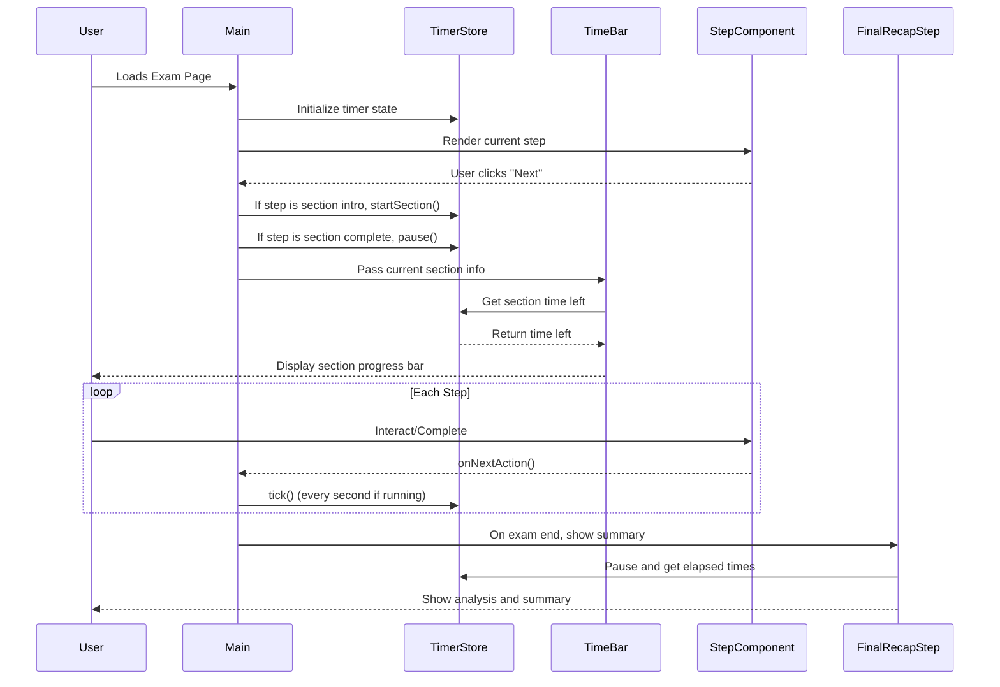

# English Test Stepper

A modern web application designed to assess English language proficiency with interactive, speech-enabled features.

## ✨ Features

- 📝 **Timed Exam**: Complete a 50-minute English proficiency test.
- 🎤 **Speech Recognition**: Answer questions using your voice with real-time audio visualization.
- 📊 **Global Progress Bar**: Track your overall progress throughout the exam.
- 🔄 **Multi-Step Workflow**: Move through different types of questions seamlessly.
- ⚡ **Instant Results**: Get feedback as soon as the test is finished.

## 🛠️ Tech Stack

- **Frontend**: [Next.js 14](https://nextjs.org/), [TailwindCSS](https://tailwindcss.com/)
- **State Management**: [Zustand](https://zustand.docs.pmnd.rs/)
- **Audio APIs**: Web Audio API, MediaRecorder API

## 🚀 Installation

1. Clone the repository:

   ```bash
   git clone https://github.com/your-repo/exam-stepper-fe.git
   cd exam-stepper-fe
   ```

2. Install dependencies:

   ```bash
   npm install
   ```

3. Run the development server:
   ```bash
   npm run dev
   ```

## 📖 Usage

1. Navigate to the application in your browser.
2. Follow the on-screen instructions to start the exam.
3. Complete each section within the allotted time.

## 📂 Project Structure

All exam sections are organized in their own folders under `exam/[attemptId]/steps/`:

- Welcome/
- Reading/
- Listening/
- Writing/
- Speaking/
- Final/

## 🤝 Contributing

Contributions are welcome! Please follow these steps:

1. Fork the repository.
2. Create a new branch for your feature or bugfix.
3. Submit a pull request with a detailed description of your changes.

## 📜 License

This project is licensed under the MIT License.

---

### Steps Flow (Visualized)


