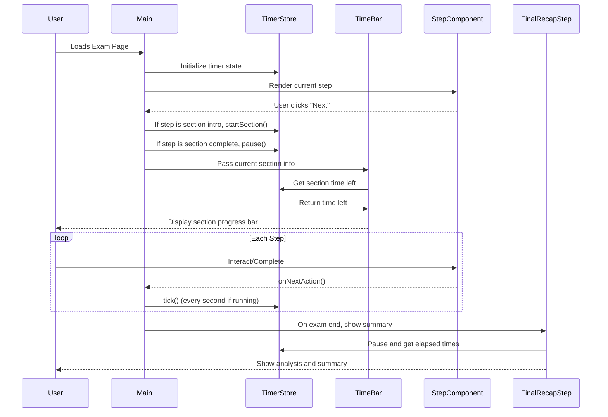

# English Test Stepper Test 

> ON WORK...

A modern web application designed to assess English language proficiency with interactive, speech-enabled features.

## ✨ Features

- 📝 **Timed Exam**: Complete a 50-minute English proficiency test.
- 🎤 **Speech Recognition**: Answer questions using your voice with real-time audio visualization. [ON WORK]
- 📊 **Global Progress Bar**: Track your overall progress throughout the exam.
- 🔄 **Multi-Step Workflow**: Move through different types of questions seamlessly.
- ⚡ **Instant Results**: Get feedback as soon as the test is finished. [ON WORK]

## 🛠️ Tech Stack

- [Next.js 14](https://nextjs.org/) – Powerful React framework for fast, scalable apps.
- [TailwindCSS](https://tailwindcss.com/) – Utility-first CSS framework for rapid UI development.
- [Zustand](https://zustand.docs.pmnd.rs/getting-started/introduction) - For state management solution
- **Web Audio API** – For capturing and visualizing real-time audio input.
- **MediaRecorder API** – For recording test taker’s audio answers.

### Steps Structure

All exam sections are now in their own folders in `exam/[attemptId]/steps/`:

- Welcome/
- Reading/
- Listening/
- Writing/
- Speaking/
- Final/

## 📌 Todo / Integration steps

### Step Organization
- [x] Refactor `steps/` folder so each exam section has its own folder and sub-steps

### Data & Types
- [x] Create `state/timerSTore.ts` to share step/result/timing types across the app with zustand

### Step Navigation
- [x] Implement `StepController` or a custom `useStepMachine` hook to manage step logic, timing, and navigation
- [x] Build out context (`ExamContext`) for global exam state (progress, results, navigation)

### UI Reusability
- [ ] Make shared UI components (Audio check, Spectrum, Timer, Progress bar) highly reusable via props

### User Session
- [ ] Add api for the user session for get username and verify if it has permission
- [ ] Add data into HEADER or panel on top as FIGMA shows

### FE "Security"
- [x] Handle the browser back button to prevent exam navigation loopholes

### Section Features
- [ ] Permission: Audio and video [ON WORK]
- [ ] Reading: Choices, long text, intro/complete
- [ ] Listening: Audio player, answer choices, intro/complete
- [ ] Writing: Word counter, AI result hook-up
- [ ] Speaking: Microphone permission, audio visualization, practice, main questions, repeat parts

### Timer 
- [ ] Handle time off, fail exam. 
 

### Steps Flow

